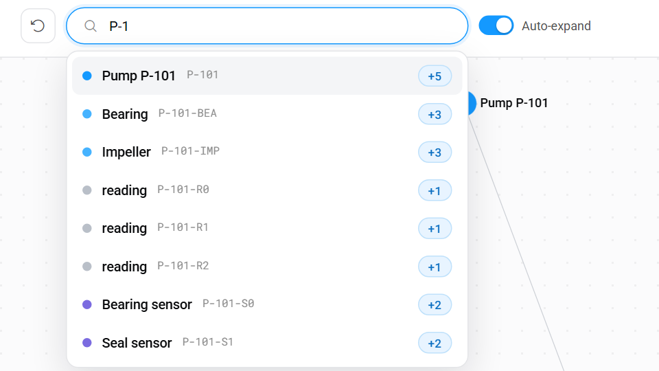
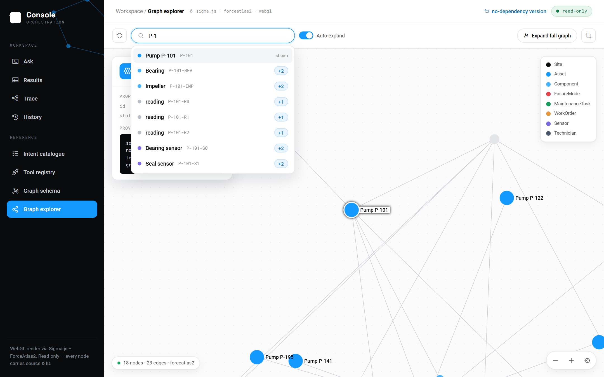
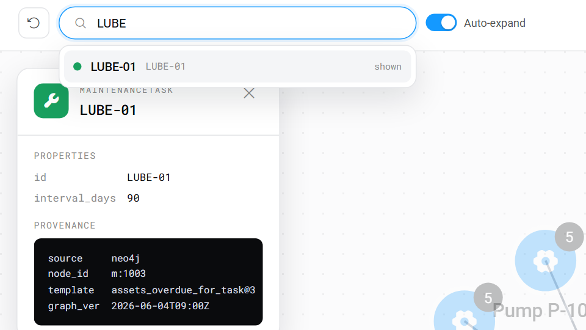
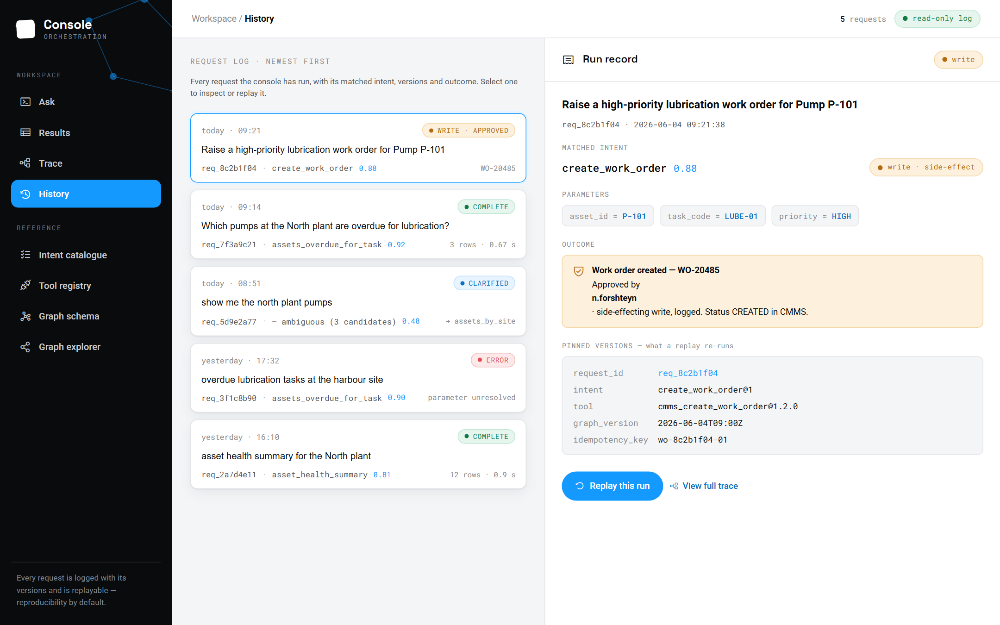
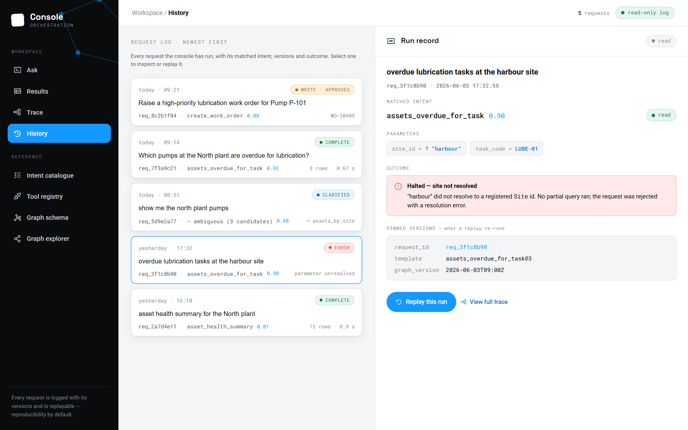
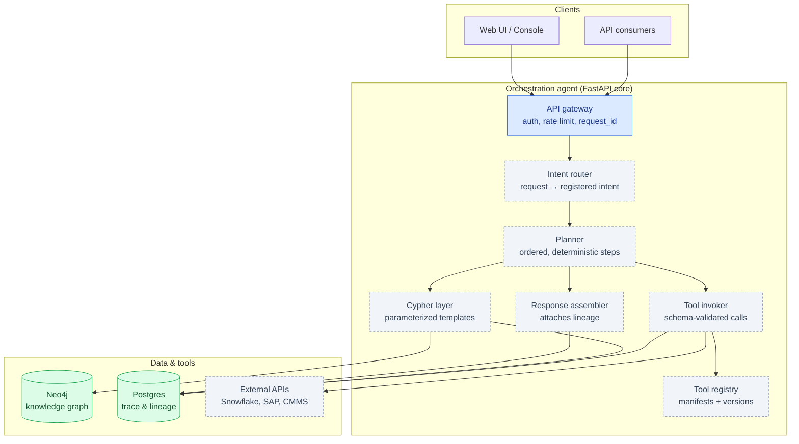
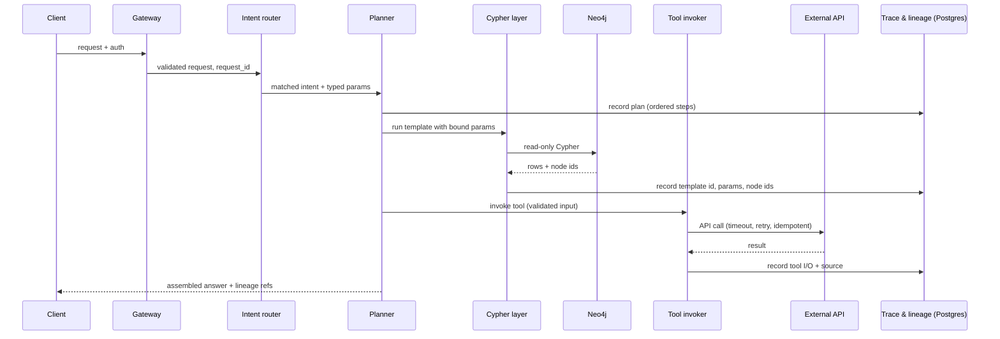
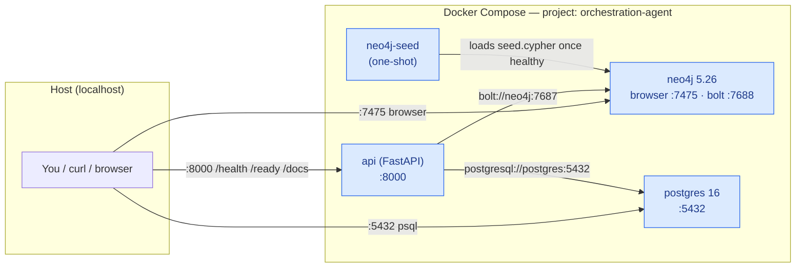
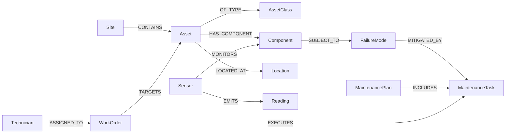
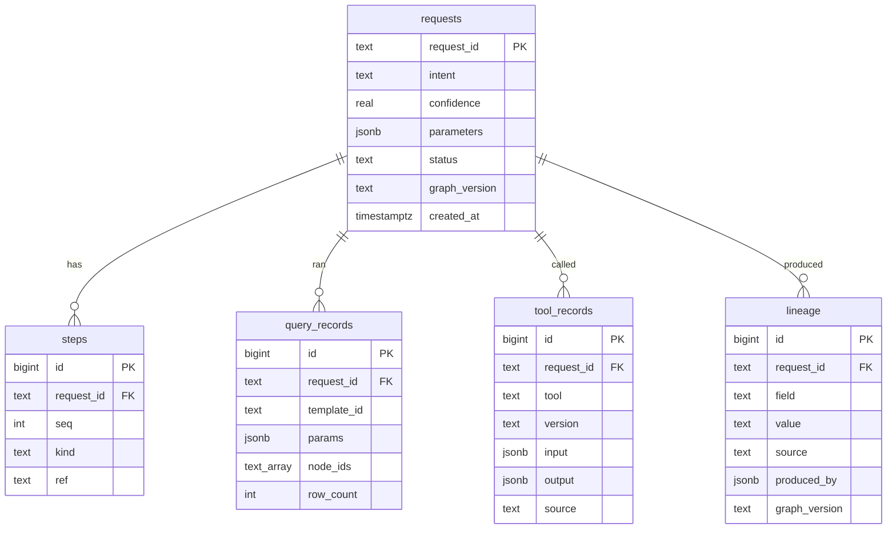

# Graph Query Agent — Orchestration Console

The **Orchestration Console** is the front-end for a controlled orchestration agent that turns
plain-English requests into **reviewed, parameterized Cypher queries** over a Neo4j knowledge graph
(plus registered external tools), where **every returned value is traceable** to the query, node IDs
and tool call that produced it.

This repository contains two things:

1. **UI design artifacts** — self-contained `.html` screens on a shared CSS design system that
   define the product's look, behaviour and states. No backend required to view them.
2. **A backend infrastructure scaffold** (`backend/` + `infra/`) — the first slice of the real
   service: Neo4j, an append-only Postgres trace/lineage store, and a FastAPI core, wired together
   and runnable via Docker Compose.

> ### The core constraint that shapes everything
> This is **not** an AI chatbot. It is a controlled, deterministic, auditable operations tool. It
> chooses among **known, registered capabilities**, never improvises a query, and **clarifies rather
> than guesses**. The UI's job is to make that machinery visible — matched intent + confidence,
> extracted parameters, the steps that ran, and **lineage on every output**. The backend enforces it
> — read-only parameterized templates, validated tool calls, and a full trace under one `request_id`.

---

## Contents

- [Repository layout](#repository-layout)
- [The UI (design artifacts)](#the-ui-design-artifacts)
  - [Screens](#screens)
  - [Screenshots](#screenshots)
  - [Design system](#design-system)
- [The backend](#the-backend)
  - [What it supports today](#what-it-supports-today)
  - [Target architecture](#target-architecture)
  - [Request lifecycle](#request-lifecycle)
  - [Local dev topology](#local-dev-topology)
  - [The knowledge graph](#the-knowledge-graph)
  - [The trace & lineage store](#the-trace--lineage-store)
- [Running everything](#running-everything)
  - [Ports](#ports)
- [Status & roadmap](#status--roadmap)

---

## Repository layout

```
index.html                      landing page linking every screen
Console - Ask.html              ⭐ the reference screen (request → intent → plan)
Results - Lineage.html          results table + lineage drawer
Trace - Audit.html              audit timeline + step inspector
Clarification.html              candidate intents + parameter completion
Intent catalogue.html           registered capabilities (read + write)
Tool registry.html              tool manifests, health + observability
Graph schema.html               graph model: labels, relationships, governance
Graph explorer.html             live instance graph — self-contained SVG force layout
Graph explorer - Sigma.html     same, rendered via Sigma.js (WebGL) + ForceAtlas2
History.html                    run log + replay

assets/
  console-system.css            ⭐ the design system (tokens + oc-* components)
  graph-explorer.bundle.js      bundled graph engine (graphology + Sigma.js + ForceAtlas2)

backend/                        FastAPI API core (health/readiness scaffold)
  app/main.py                   /health, /ready
  app/config.py                 env-driven settings
  app/db/{neo4j,postgres}.py    driver/pool + connectivity checks
infra/
  docker-compose.yml            Neo4j + Postgres + API core (local dev)
  neo4j/seed.cypher             constraints + shared example data
  postgres/init.sql             append-only trace/lineage schema

docs/
  orchestration-agent-spec.md   technical spec (graph schema, lineage, determinism)
  ui-design-brief.md            UI brief + per-screen prompts + shared example data
  backend-infrastructure.md     what infra the spec needs + how this scaffold maps to it

Dockerfile / docker-compose.yml static-server image (nginx) for the UI preview
```

---

## The UI (design artifacts)

Self-contained HTML files — open `index.html` in a browser, no build step. All data is illustrative
and baked in; every screen reuses the **same scenario** for consistency: *"Which pumps at the North
plant are overdue for lubrication?"* → intent `assets_overdue_for_task` (confidence 0.92), params
`site_id=SITE-NORTH` / `task_code=LUBE-01`, returning pumps **P-101 / P-104 / P-110**.

### Screens

All screens share one design system and a **master–detail** pattern: work/list on the left, an
**evidence pane on the right** carrying real visual weight (lineage, step inspector, run record).

| Screen | Purpose |
|---|---|
| **Console — Ask** ⭐ | Reference screen: request box → matched intent + confidence → editable params → step tracker. Includes the write-approval gate + modal and the low-confidence clarification path. |
| **Results — Lineage** | Results table with a lineage drawer — every value drills down to its provenance. |
| **Trace — Audit** | Audit timeline + per-step inspector (bound Cypher, node IDs, tool I/O). |
| **Clarification** | Candidate intents + typed parameter completion for ambiguous requests. |
| **Intent catalogue** | The registered capabilities, read and write, with detail. |
| **Tool registry** | Tool manifests, health, and observability. |
| **Graph schema** | The graph model: labels, relationships, governance. |
| **Graph explorer** | Live instance graph — SVG (no-dep) and Sigma.js/WebGL variants. |
| **History** | Run log with replay — every past request, its intent, confidence, outcome, and full trace. |

### Screenshots

**Graph explorer — searchable autocomplete.** Typing in the explorer surfaces matching nodes with
their business IDs, a color-coded dot per node type, and a neighbour-count badge (`+5`, `+3`…)
showing how many edges each node would expand. The *Auto-expand* toggle controls whether selecting a
match immediately expands its neighbourhood.



**Graph explorer — full screen (Sigma.js / WebGL).** The autocomplete open over the force-directed
layout, with the dark rail, the node-type legend (Site, Asset, Component, FailureMode,
MaintenanceTask, WorkOrder, Sensor, Technician), the `read-only` / `no-dependency version` badges, and
*Expand full graph*. This is the ForceAtlas2-rendered variant backed by `graph-explorer.bundle.js`.



**Graph explorer — node provenance.** Selecting a node opens its evidence panel: typed
**Properties** plus a **Provenance** block — `source` (neo4j), `node_id`, the `template` that
produced it (`assets_overdue_for_task@3`), and the `graph_ver` timestamp. Lineage is first-class even
at the single-node level. (Shown here in the no-dependency SVG explorer, searching `LUBE`.)



**History — run log (write action).** The run log lists past requests newest-first with their
matched intent, confidence, and an outcome pill. The selected **Run record** is a *write* action —
"Raise a high-priority lubrication work order for Pump P-101" — showing the side-effecting tool call
that was **approved and logged** (`WO-20485`), the bound parameters, and the fields needed to
reproduce it: `request_id`, `tool` + version, `graph_version`, and the `idempotency_key`. Note the
amber **write** encoding and the *Replay this run* / *View full trace* affordances.



**History — halted / error run.** The same screen with a rejected request selected:
"overdue lubrication tasks at the harbour site" matched `assets_overdue_for_task`, but `harbour` did
not resolve to a registered `Site` id. The agent **halted and asked to clarify rather than guessing**
— no partial query ran. This is the "clarify, don't guess" principle made auditable.



### Design system

A modern, calm enterprise aesthetic defined entirely in `assets/console-system.css` (self-contained;
all classes namespaced `oc-*`).

- **Base:** white / light-grey surfaces, near-black ink, light hairlines, soft shadows; a dark left rail.
- **Accent:** a single bright blue — interactive elements, links, the confidence meter.
- **Status encoding (hard rule):** 🟢 green = **read** (calm, default) · 🟠 amber = **write**
  (side-effect, needs confirmation) · 🔴 red = **error** · 🔵 blue = accent. Read results look calm;
  write/side-effecting actions are visually distinct and require explicit confirmation.
- **Type:** Space Grotesk (display), Roboto (UI), Roboto Mono (IDs / Cypher / parameters).

The graph engine is bundled locally (`assets/graph-explorer.bundle.js`); fonts and icons load from
CDNs (Google Fonts, Phosphor), so a running container needs network to render them.

---

## The backend

The backend is described in full in [`docs/orchestration-agent-spec.md`](docs/orchestration-agent-spec.md);
this repo currently implements the **infrastructure scaffold** (see
[`docs/backend-infrastructure.md`](docs/backend-infrastructure.md)).

### What it supports today

A runnable Docker Compose stack that stands up the services the agent depends on and proves
connectivity end to end:

| Service | Role | Status |
|---|---|---|
| **Neo4j** | Knowledge graph; parameterized read-only Cypher (spec §5.4, §11) | ✅ wired + seeded |
| **Postgres** | Append-only trace & lineage store; basis for replay (spec §10) | ✅ wired + schema |
| **FastAPI core** | API gateway / router / planner / assembler (spec §5.1–§5.7) | ◑ scaffold — `/health`, `/ready`, `/docs` |
| Secrets manager | Resolve `secret_ref` / DB creds (spec §13) | ⏳ deferred (env vars locally) |
| OpenTelemetry | Tracing + metrics across the request path (spec §14) | ⏳ deferred |
| External adapters (Snowflake/SAP/CMMS) | Registered tools behind a uniform `invoke()` (spec §8–§9) | ⏳ deferred |

The FastAPI app currently exposes:

- `GET /health` — **liveness**: the process is up (no dependency checks).
- `GET /ready` — **readiness**: pings Neo4j and Postgres; `200` when both are reachable, `503`
  (`degraded`) otherwise.
- `GET /docs` — auto-generated OpenAPI / Swagger UI.

The orchestration logic itself (intent router, planner, Cypher template layer, tool registry,
lineage assembler) is intentionally **not** implemented yet — that's the next phase. The UI screens
do **not** yet call this API; they remain self-contained design artifacts.

### Target architecture

The full service the design and spec describe:



<sub>🟩 wired & running · 🟦 scaffolded (health/readiness) · ⬜ planned (not yet implemented)</sub>

### Request lifecycle

How a request becomes a traceable answer (spec §6) — the target flow once the orchestration layer
lands:



### Local dev topology

What `infra/docker-compose.yml` actually brings up today:



> Neo4j host ports are remapped (browser `7475→7474`, bolt `7688→7687`) so this stack can coexist
> with any other local Neo4j. Inside the Compose network the API still reaches it at
> `bolt://neo4j:7687`.

### The knowledge graph

The maintenance & engineering domain graph (spec §11). Node names use engineering vocabulary and are
aligned with domain experts; the seed loads the shared example scenario.



`infra/neo4j/seed.cypher` provisions uniqueness constraints and the canonical scenario: `SITE-NORTH`,
maintenance task `LUBE-01`, and pumps `P-101` / `P-104` / `P-110` with overdue work orders — so the
`assets_overdue_for_task` query returns real rows.

### The trace & lineage store

Postgres holds the **append-only** audit log (spec §10). The orchestrator only ever `INSERT`s;
`UPDATE`/`DELETE`/`TRUNCATE` are revoked from the application role. One row of provenance is recorded
per output field, so any answer is reproducible from its trace.



---

## Running everything

**UI only** (static design artifacts):

```bash
python3 -m http.server 8000        # → http://localhost:8000/
# or
docker compose up --build          # → http://localhost:8080/  (nginx)
```

In **Console - Ask.html**, click *Confirm & run plan* to watch the step tracker execute, expand any
step for its bound Cypher / node IDs / tool I/O, and use the *High confidence / Ambiguous / Write
action* toggle to see the "clarify, don't guess" path and the write-approval gate.

**Backend infrastructure** (Neo4j + Postgres + API):

```bash
docker compose -f infra/docker-compose.yml up --build      # → API on http://localhost:8000
```

Verify it's live:

```bash
curl http://localhost:8000/health       # {"status":"ok",...}
curl http://localhost:8000/ready        # {"status":"ready","checks":{"neo4j":"up","postgres":"up"}}
# open http://localhost:8000/docs        ← Swagger UI
```

Tear down (add `-v` to drop volumes and re-seed on next boot):

```bash
docker compose -f infra/docker-compose.yml down
```

### Ports

| Port | Service | Notes |
|---|---|---|
| **8080** | UI design console | the static screens (nginx) |
| **8000** | Backend API | `/health`, `/ready`, `/docs` |
| **7475** | Neo4j Browser | login `neo4j` / `orchestrator`, connect to `bolt://localhost:7688` |
| **7688** | Neo4j Bolt | remapped off the default 7687 |
| **5432** | Postgres | db `trace`, user/pass `orchestrator` |

> Credentials here are local-dev defaults only. In production they resolve from a secrets manager
> (spec §13) — never commit real credentials.

---

## Status & roadmap

| Area | State |
|---|---|
| UI — all screens (Ask, Results, Trace, Clarification, Catalogue, Registry, Schema, Explorer, History) | ✅ hi-fi |
| Backend — Neo4j + Postgres + FastAPI scaffold, seeded, health/readiness | ✅ running |
| Cypher template layer + first read intents end-to-end with lineage writes | ⏳ phase 1 |
| Tool registry + invoker + first external adapter + secrets manager | ⏳ phase 2 |
| Deterministic intent router + parameter extraction (+ LLM observability) | ⏳ phase 3 |
| OpenTelemetry collector + instrumentation | ⏳ phase 4 |

See [`docs/backend-infrastructure.md`](docs/backend-infrastructure.md) for the detailed breakdown and
[`docs/orchestration-agent-spec.md`](docs/orchestration-agent-spec.md) for the full technical spec.
