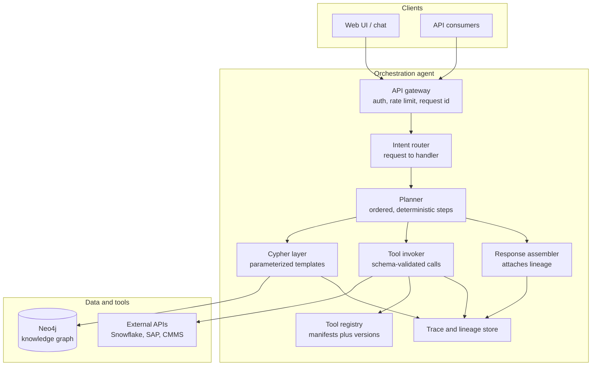
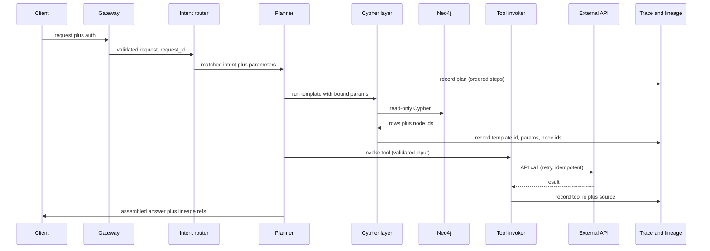
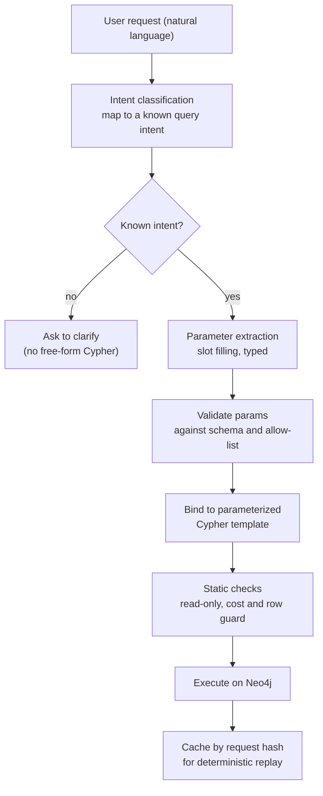
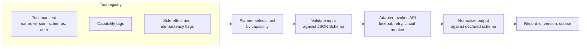
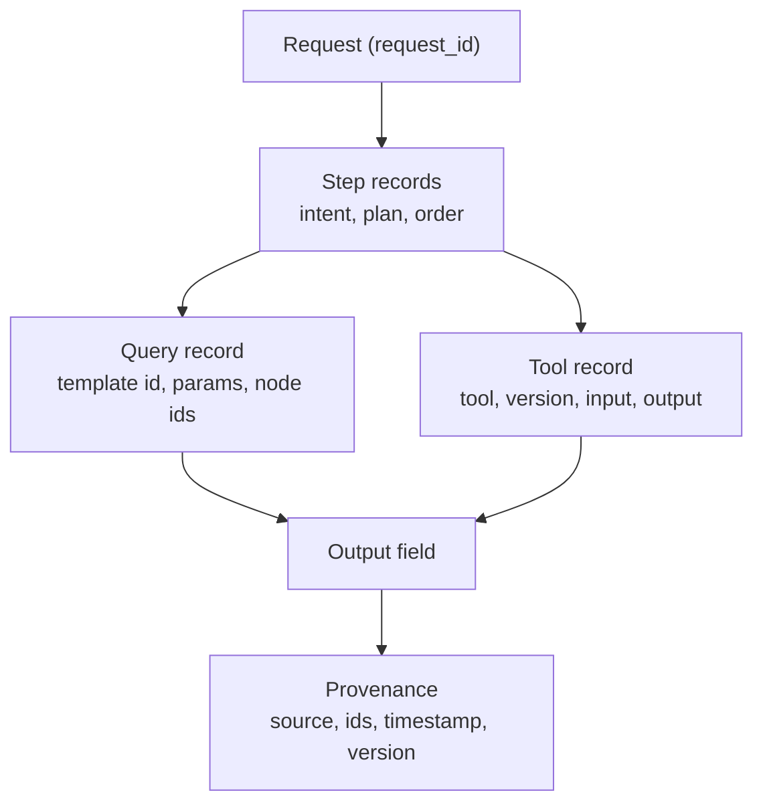
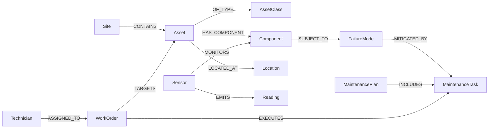

# Specification — Lightweight Orchestration Agent over Neo4j + Tools

A pragmatic, controlled orchestration service that turns user requests into **parameterized Cypher queries** and **registered tool calls** over a maintenance & engineering knowledge graph — with deterministic, fully traceable outputs and clear data lineage.

> **Design clarifier (read first).** This is *pragmatic orchestration of structured data and tools*, **not** an autonomous GenAI agent. There is no open-ended reasoning loop, no self-directed tool discovery, no free-form Cypher executed at runtime. Every action is a **registered, schema-validated, logged** step selected by **deterministic routing logic**. Where a language model is used at all, it is confined to *classifying intent* and *extracting typed parameters* — never to generating arbitrary queries or deciding control flow.

---

## 1. Purpose & objectives

Build a service that lets users (and downstream systems) ask questions and trigger actions against an engineering/maintenance domain, where:

1. A request is mapped to a **known intent** (a registered capability).
2. The intent runs one or more **parameterized Cypher templates** against Neo4j and/or invokes one or more **registered tools** (external APIs).
3. The result is assembled with **provenance** so every output value can be traced back to the exact query, node IDs, and tool calls that produced it.
4. The same request against the same graph state yields the **same plan and the same result** (determinism).

### Success criteria
- 100% of executed Cypher is parameterized and read-only by default (writes are explicit, gated capabilities).
- 100% of requests produce a trace with full lineage; any output can be reproduced from its trace.
- New tools/queries are added by **registration** (manifest + template), not by changing core code.
- Graph schema concepts map cleanly to terms domain experts recognise.

---

## 2. Scope

### In scope
- Request intake API and (optional) thin UI.
- Deterministic intent router and step planner.
- Parameterized Cypher template library + execution layer.
- Tool registry (plugin manifests) and controlled tool invocation.
- API integration adapters (e.g. Snowflake, SAP, CMMS) behind a consistent interface.
- Trace + data-lineage store and reproducible replay.
- Graph-schema governance process with domain experts.

### Out of scope (the clarifier in practice)
- Autonomous multi-step agent reasoning / self-planning loops.
- Free-form, model-generated Cypher executed without template + validation.
- Open-ended tool discovery or tool creation at runtime.
- Model fine-tuning / training.

---

## 3. Design principles

| Principle | What it means here |
|---|---|
| **Deterministic by default** | Rule/registry-based routing; parameterized templates; no runtime randomness; identical request + graph state produces identical plan + output. |
| **Controlled, not autonomous** | The set of intents, queries, and tools is a curated, versioned catalogue. The system chooses *among registered options*; it does not improvise. |
| **Everything is traceable** | Every request, step, query (with bound params and returned node IDs), and tool call (with inputs/outputs) is recorded under one `request_id`. |
| **Lineage on every output** | Each output field carries provenance: which template, which node IDs, which tool/source, version, timestamp. |
| **Safety at the boundary** | Read-only Cypher unless a write capability is explicitly invoked; inputs validated against JSON Schema; cost guards on queries. |
| **Extend by registration** | Adding a capability = add a manifest + template, not edit orchestrator code. |
| **Domain-aligned graph** | Node/edge names reflect maintenance & engineering concepts agreed with domain experts. |

---

## 4. System architecture



---

## 5. Core components

### 5.1 API gateway
- Authenticates the caller, applies rate limits, assigns a `request_id`, validates the request envelope.
- Stateless; safe to scale horizontally.

### 5.2 Intent router
- Maps an incoming request to exactly one **registered intent** (a capability).
- Routing is **deterministic**: a rules/keyword/classifier layer that resolves to a known intent ID, or returns "unmatched" (which asks for clarification — it never improvises a query).
- If a language model assists, it is constrained to *classification* (pick from the known intent list) and returns a confidence score; low confidence falls back to clarification.

### 5.3 Planner
- Expands the matched intent into an **ordered list of steps** (Cypher template runs and/or tool calls). The step list for a given intent is defined in the intent manifest — not invented at runtime.
- Records the plan to the trace store *before* execution.

### 5.4 Cypher layer
- Holds a versioned library of **parameterized Cypher templates**, one per query intent.
- Binds extracted parameters (never string-concatenates), runs read-only queries by default, applies cost/row guards.
- Returns rows **plus** the node/relationship IDs touched (for lineage).

### 5.5 Tool registry
- Stores tool **manifests** (Section 9). Tools are registered at startup or via an admin endpoint; the planner selects among them by capability tag.

### 5.6 Tool invoker
- Validates tool input against the manifest's JSON Schema, invokes the tool's adapter with timeout / retry / circuit-breaker, normalises output against the declared output schema, records I/O.

### 5.7 Response assembler
- Combines query rows and tool outputs into the response payload and attaches **lineage references** to each field.

### 5.8 Trace & lineage store
- Append-only record of requests, plans, queries, and tool calls; supports reproduction/replay.

---

## 6. Request lifecycle



---

## 7. Translating requests into Cypher (controlled)

The defining requirement — done **safely and deterministically**. No model-generated query is executed verbatim.



**Why this is deterministic and controlled:**
- The query body comes from a **reviewed template**, not the model. Only *parameters* are dynamic, and they are typed + validated + bound (no injection).
- Unknown intents are refused, not guessed.
- Templates are **read-only** unless the intent is an explicitly-registered write capability with its own approval gate.
- A request hash (intent + bound params + graph version marker) enables **replay**: the same inputs return the same result, and the trace proves it.

### Example query intent (illustrative)
```yaml
intent: assets_overdue_for_task
description: List assets at a site whose preventive task is overdue.
parameters:
  site_id:   { type: string, required: true }
  task_code: { type: string, required: true }
cypher: |
  MATCH (s:Site {id: $site_id})-[:CONTAINS]->(a:Asset)
  MATCH (a)<-[:TARGETS]-(wo:WorkOrder)-[:EXECUTES]->(t:MaintenanceTask {code: $task_code})
  WHERE wo.due_date < date() AND wo.status <> 'CLOSED'
  RETURN a.id AS asset_id, a.name AS asset, wo.due_date AS due, wo.status AS status
  ORDER BY wo.due_date ASC
read_only: true
returns: [asset_id, asset, due, status]
```

---

## 8. Tool registry & plugin architecture



### Tool manifest (contract)
```yaml
name: cmms_create_work_order
version: 1.2.0
description: Create a work order in the CMMS for an asset.
capability_tags: [work_order, write]
input_schema:        # JSON Schema
  type: object
  required: [asset_id, task_code, priority]
  properties:
    asset_id:  { type: string }
    task_code: { type: string }
    priority:  { type: string, enum: [low, medium, high] }
output_schema:
  type: object
  properties:
    work_order_id: { type: string }
    status:        { type: string }
side_effect: true          # has external effects
idempotent: false          # requires an idempotency key
auth: { type: oauth2, secret_ref: cmms/client }
timeout_ms: 8000
retry: { max_attempts: 3, backoff: exponential }
```

**Plugin rules:**
- A tool is added by registering a manifest + an adapter that implements a single interface (`invoke(validated_input) -> output`). Core code does not change.
- `side_effect: true` tools require an **idempotency key** and may require an approval gate.
- The planner may only call tools whose `capability_tags` the matched intent declares — capabilities are an allow-list per intent.

---

## 9. API integration patterns (consistent & controlled)

Every external system (Snowflake, SAP, a CMMS) sits behind a uniform **adapter**:

| Pattern | Rule |
|---|---|
| **Single interface** | Each adapter implements the same `invoke()` contract; the invoker treats all tools identically. |
| **Schema in / schema out** | Input validated before the call; output normalised to the declared schema after. |
| **Secrets** | Credentials resolved from a secrets manager via `secret_ref`; never in manifests or code. |
| **Resilience** | Per-tool timeout, bounded retries with backoff, circuit breaker on repeated failure. |
| **Idempotency** | Write tools take an idempotency key derived from `request_id` + payload hash, so retries don't double-apply. |
| **Read vs write** | Reads run freely; writes are explicit capabilities, logged, and (optionally) require approval. |
| **Normalisation** | Adapters translate vendor payloads into domain terms so the graph and outputs stay vocabulary-consistent. |

---

## 10. Determinism, traceability & data lineage



### Determinism guarantees
- Routing and planning are pure functions of (request, registry version).
- Cypher is template-bound; no randomness; if a model is used, it runs at temperature 0 and only for classification/extraction, with results cached by request hash.
- Tool and template **versions** are pinned and recorded, so a replay uses the same logic.

### Lineage record (per output field)
```json
{
  "field": "asset",
  "value": "Pump P-101",
  "source": "neo4j",
  "produced_by": { "template": "assets_overdue_for_task@3", "node_ids": ["a:1042"] },
  "graph_version": "2026-06-04T09:00Z",
  "request_id": "req_7f3a...",
  "timestamp": "2026-06-04T09:14:21Z"
}
```

For tool-sourced fields, `source` names the external system and `produced_by` records the tool, version, and request payload hash. This makes every answer **auditable** and **reproducible**.

---

## 11. The maintenance & engineering knowledge graph

Indicative schema, to be aligned with domain experts (Section 12). Node names use engineering vocabulary.



| Node | Meaning |
|---|---|
| **Site / Location** | Physical place an asset lives. |
| **Asset / AssetClass** | A maintained item and its type/model. |
| **Component** | A part of an asset that can fail. |
| **FailureMode** | A way a component fails (FMEA concept). |
| **MaintenanceTask / MaintenancePlan** | A procedure and the plan that schedules it. |
| **WorkOrder** | A unit of executed/scheduled maintenance work. |
| **Technician** | Person assigned to work. |
| **Sensor / Reading** | Condition-monitoring source and its time-series values. |

Constraints: uniqueness on `(label, business_id)`; relationships carry properties where needed (e.g. `WorkOrder.due_date`, `Reading.ts`, `Reading.value`).

---

## 12. Aligning the graph with domain experts

A recurring governance loop, not a one-off:

1. **Concept workshops** — domain experts (reliability/maintenance engineers) define the entities and relationships in their language.
2. **Schema as a reviewed artefact** — node labels, relationship types, and key properties are version-controlled and signed off.
3. **Glossary** — every label maps to a plain-English definition the experts agree on.
4. **Query-intent co-design** — each new query intent is validated against a real question an engineer asks ("which assets are overdue for lubrication at Site X?").
5. **Change control** — schema changes go through review; migrations are scripted and recorded so lineage `graph_version` stays meaningful.

---

## 13. Security & access control
- AuthN at the gateway; AuthZ per intent and per capability (read vs write).
- Write capabilities and side-effecting tools require elevated scope and are always logged.
- Secrets via a secrets manager; least-privilege Neo4j and API credentials.
- All Cypher parameterized — no string interpolation — to prevent injection.

## 14. Observability
- Structured logs keyed by `request_id`.
- Metrics: request rate, intent match rate, unmatched rate, query latency, tool latency/error rate, retries, circuit-breaker trips.
- Distributed tracing across gateway → planner → Cypher/tool calls.
- The trace store doubles as the audit log.

## 15. Tech stack (proposed)
| Layer | Choice | Rationale |
|---|---|---|
| Language | **Python 3.11+** | Required skill; strong Neo4j + API ecosystem. |
| API | FastAPI | Async, schema-first (Pydantic), OpenAPI out of the box. |
| Graph | **Neo4j** (+ official Python driver) | Required; parameterized Cypher, optional vector index for graph-retrieval. |
| Validation | Pydantic / JSON Schema | Manifest + parameter validation. |
| Trace store | Postgres (append-only tables) | Durable, queryable lineage; simple and deterministic. |
| Secrets | Cloud secrets manager | No secrets in code/manifests. |
| Tracing/metrics | OpenTelemetry | Vendor-neutral observability. |
| Enterprise adapters | Snowflake / SAP / CMMS SDKs | "Nice to have" data platforms behind the uniform adapter contract. |

## 16. Non-functional requirements
- **Latency:** typical read intent answered in < 1s (excluding slow external tools).
- **Determinism:** replaying a `request_id` reproduces the output (modulo declared graph version).
- **Extensibility:** a new query intent or tool ships with no core-code change.
- **Auditability:** every output field traces to its source.
- **Availability:** stateless core scales horizontally; external failures degrade gracefully via circuit breakers.

## 17. Testing strategy
- **Unit:** template binding, parameter validation, manifest validation, lineage construction.
- **Contract:** each tool adapter tested against its manifest schema (input/output).
- **Cypher:** templates run against a seeded test graph; assert read-only and result shape.
- **Determinism:** same request twice → identical plan + output + matching trace.
- **Golden lineage:** snapshot tests asserting provenance is attached to every field.
- **Negative:** unknown intent → clarification (never a guessed query); invalid params → rejection.

## 18. Phased delivery

| Phase | Deliverable |
|---|---|
| **1 — Foundations** | Gateway + trace store + read-only Cypher template runner; 2–3 query intents end to end with lineage. |
| **2 — Tool registry** | Manifest schema, registry, invoker with validation/retry; first external read tool (e.g. Snowflake lookup). |
| **3 — Routing** | Deterministic intent router + parameter extraction + clarification path; expand template library. |
| **4 — Write capabilities** | Idempotent, gated write tools (e.g. CMMS work-order creation) with approval + audit. |
| **5 — Hardening** | Cost guards, circuit breakers, full observability, replay tooling, schema governance loop with domain experts. |

## 19. Risks & mitigations
| Risk | Mitigation |
|---|---|
| Ambiguous requests routed to the wrong intent | Confidence threshold + clarification fallback; never improvise Cypher. |
| Schema drift breaks templates | Version-controlled schema + migrations; templates pinned to schema version; contract tests. |
| External API instability | Timeouts, bounded retries, circuit breakers, normalised errors. |
| "Scope creep toward autonomy" | The clarifier is a design constraint: registered capabilities only; reviewed in change control. |
| Lineage gaps | Lineage is mandatory in the assembler; golden tests fail the build if a field lacks provenance. |

## 20. Open questions for stakeholders
- Which external systems are in scope for v1 (Snowflake? SAP? a specific CMMS)?
- Are write operations in v1 scope, or read-only first?
- Who owns/approves the query-intent and tool catalogue?
- What is the authoritative source for the graph (ETL from SAP/CMMS, or curated)?
- Expected query volume and latency targets?

## 21. Glossary
- **Intent** — a registered capability mapping a request to a defined set of steps.
- **Query template** — a reviewed, parameterized Cypher statement bound to an intent.
- **Tool** — a registered external action described by a manifest and invoked through an adapter.
- **Lineage** — the recorded provenance of each output value.
- **Determinism** — same inputs + graph version produce the same plan and output.
